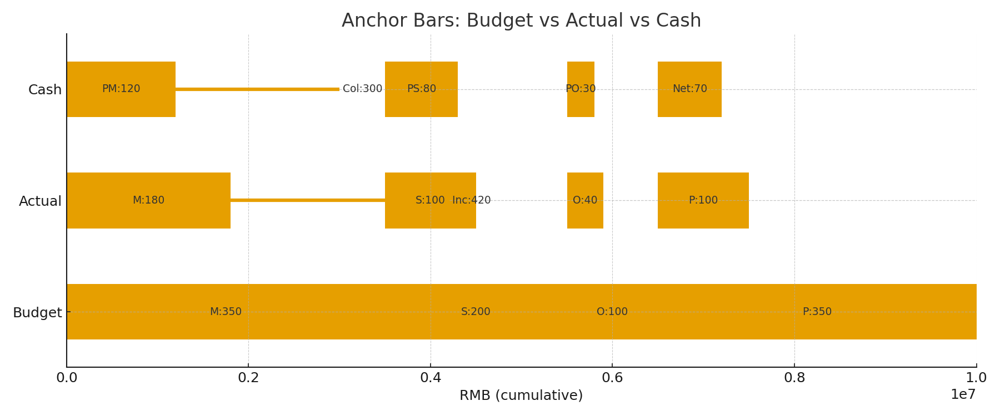
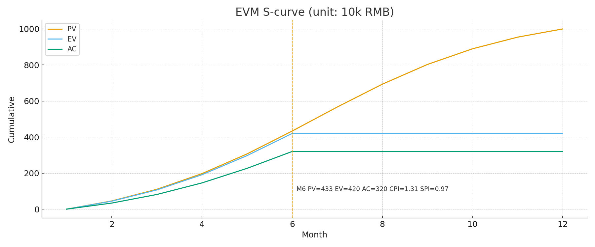
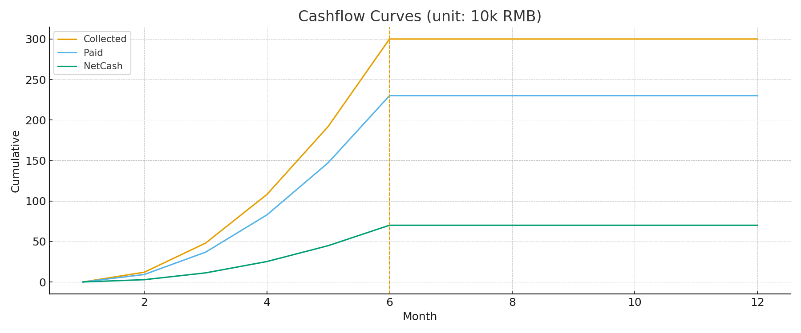

# 项目管理中的穿透式管理：价值—资金一体化的可视化方法论与实现

**作者**：——  
**版本**：v1.0

## 摘要
在复杂工程项目中，传统做法往往将进度（甘特）、成本（费用报表）与现金流（收付表）分离呈现，造成认知割裂与沟通成本高。本文提出一种面向**项目管理**的“**穿透式管理**”方法：以**三行对齐进度条**作为锚点视图，在**统一时间轴**上结合**EVM S 曲线（PV/EV/AC）**与**现金流曲线（收/付/净）**，辅以**时间滑块/动画**的交互，使“计划价值—挣得价值—实际成本—现金流”在同一视域内穿透呈现。该方法兼顾新手、专业 PM 与管理层的认知差异，显著降低信息转换开销，形成“价值—资金”联动的决策闭环。

**关键词**：项目管理；穿透式管理；挣值管理（EVM）；S 曲线；现金流；可视化；BIM/数字孪生

---

## 1. 背景与问题
- **信息分散**：计划、产出、成本、收付分处不同报表，时相口径不一致。  
- **认知负荷高**：管理者需要在脑内完成“跨图对齐”和“口径转换”。  
- **沟通效率低**：不同经验层级对同一问题的解读差异大。

**目标**：用一个统一的可视化框架，把“价值（PV/EV/AC）”与“资金（In/Out/Net）”在**同一时间轴**上穿透展示，降低门槛、提升决策效率。

---

## 2. 概念与指标（简明解释）
- **PV（Planned Value，计划价值）**：到某时点按计划应完成的工作价值。  
- **EV（Earned Value，挣得价值）**：实际已完成工作折算的价值。  
- **AC（Actual Cost，实际成本）**：实际发生的成本支出。  
- **CPI（Cost Performance Index）= EV / AC**：成本效率；>1 表示省钱。  
- **SPI（Schedule Performance Index）= EV / PV**：进度效率；<1 表示滞后。  
- **现金流（Cash Flow）**：  
  - **收款（Inflow）**、**付款（Outflow）**、**净现金（Net）= 收款 − 付款**；  
  - **累计净现金**用于识别缺口峰值与发生时点（融资窗口）。

---

## 3. 方法论框架（四层结构）
**核心设计原则：统一时间轴 + 对齐锚点 + 分层呈现 + 可解释**

1) **锚点视图：三行对齐进度条**  
   - 统一标尺（以计划收入=100%）  
   - 三行：**预算**（收入→成本分项→利润）/ **实际**（收入→成本分项→利润）/ **现金流**（收款→付款分项→净现金）  
   - **左端对齐**：材料/分包/其他与预算对应分项严密对齐 → 一眼看偏差所在

2) **价值维度：EVM S 曲线（PV/EV/AC）**  
   - 同轴三线：PV（计划）、EV（产出）、AC（成本）  
   - KPI：**CPI、SPI**；状态点读数 + 里程碑竖线  
   - 支持 EAC/ETC 等简单预测（可选）

3) **资金维度：现金流曲线（收/付/净）**  
   - 同轴三线：累计收款、累计付款、累计净现金  
   - 识别现金缺口区、峰值与发生时点  
   - 与 S 曲线联读：**效率好 ≠ 现金充裕**

4) **交互层：时间滑块 / 动画**  
   - 曲线随时间“长出来”，降低理解成本  
   - **只看偏差**（高亮 EV−PV、In−Out 区间）、**新手/专家模式**（分层信息密度）

> 通过“锚点 + 曲线 + 交互”的组合，把结构对齐、趋势判断与时相细节统一到一屏。

---

## 4. 图形化实现方法比较（按对象分层）

| 场景/对象 | 主要视图 | 交互 | 数据需求 | 适用工具/实现 | 优点 | 注意点 |
|---|---|---|---|---|---|---|
| **新手/非 PM** | 三行对齐进度条（锚点）+ 简化单线曲线 | 时间滑块、只看偏差开关、灯号（CPI/SPI/净现金） | 月度汇总即可 | 纯 HTML/Canvas（零依赖）；Power BI 简化页 | 直观、易懂、上手快 | 数量少、信息折叠但可一键展开 |
| **专业 PM/计划工程师** | 完整 S 曲线（PV/EV/AC）+ 现金流三线 | 里程碑标注、阈值带、状态点解读、导出 CSV | 月/周时相 + 分项（材料/分包/其他） | Web 前端/BI；Python 脚本生成图形 | 分析充分、可复盘与预测 | 需口径一致与数据质量 |
| **管理层/业主** | 关键曲线 + 情景播放 | 时间回放、情景切换（基线/当前/目标） | 汇总级数据 + KPI | Power BI/前端；BIM/4D 联动（Synchro等） | 说服力强、便于决策 | 动画点到即止，避免炫技 |

> 建议采用“**同屏双模式**”：默认新手视图，一键切换专家视图；同一数据源、不同信息密度。

---

## 5. 案例（示意图：数值内嵌）
> 注：以下三图为示意，均由脚本生成；**数值已内嵌**（单位：万元），无需单独表格。

- **图 1｜三行对齐进度条（锚点视图）**  
  

- **图 2｜EVM S 曲线（PV/EV/AC）**  
  

- **图 3｜现金流曲线（收/付/净）**  
  

**读图要点（状态月）**：  
- PV≈433、EV=420、AC=320 → **CPI≈1.31（成本效率好）、SPI≈0.97（进度略滞后）**  
- 累计收款 300、累计付款 230、**净现金 +70** → 现金总体为正，但回款仍低于价值产出

---

## 6. 落地路径（最小可行到高级形态）
1) **最小可行（MVP）**  
   - 数据：月度计划/实际/收付 CSV  
   - 脚本：Python 计算 PV/EV/AC、CPI/SPI 与现金流曲线 → 生成 PNG/HTML  
   - 页面：锚点条 + 两张曲线 + KPI 卡片（零依赖前端）

2) **迭代增强**  
   - 前端：加入时间滑块、偏差高亮、里程碑标注、情景切换  
   - BI：Power BI 仪表板，定时刷新  
   - 过程：周/月复盘 → 指标解读 → 纠偏计划/EAC/资金安排

3) **高级形态（BIM/4D/数字孪生）**  
   - 曲线与模型联动：选中曲线段高亮构件/工区  
   - 现金流热力：对分包/工区显示收付强度  
   - 汇报：一分钟时间回放，直观呈现“时间—空间—资金”的穿透关系

---

## 7. 讨论与局限
- **EVM 与现金流口径差异**：AC 是成本，会计口径；现金流受收付节奏与合同条款影响，不能混用。  
- **数据质量**：基线与实际若未按时相维护，曲线即失真。  
- **动画节制**：动画用于时序理解与情景切换，不宜过多影响读图效率。  
- **组织配套**：需明确口径、节拍（周/月）与责任人，保证数据进入节奏。

---

## 8. 结论
“**三行对齐进度条 + S 曲线 + 现金流 + 时间滑块**”为**项目管理**提供了一套“**穿透式管理**”的可视化方法：  
- 以**对齐锚点**降低认知门槛；  
- 以**价值曲线与资金曲线**构成联动闭环；  
- 以**分层呈现与交互**适配不同人群场景。  
该方法具备明确的可落地性，可作为工程项目在进度—成本—现金流一体化管理的实用框架。

---

## 附录 A｜可复现的最小 Python 计算示例
> 说明：用于从“月度 PV/EV/AC、收/付”序列生成三张图（与本文示意一致）；可嵌入到 CI 或定时任务。

```python
import numpy as np, matplotlib.pyplot as plt

# —— 输入：月度累计（或当月值后做累计）
PV = np.array([0, 40, 120, 220, 320, 433, 560, 690, 800, 900, 960, 1000]) * 1e4
EV = np.array([0, 30, 90, 180, 300, 420, 420, 420, 420, 420, 420, 420]) * 1e4
AC = np.array([0, 20, 60, 120, 220, 320, 320, 320, 320, 320, 320, 320]) * 1e4

COLL = np.array([0, 20, 60, 100, 200, 300, 300, 300, 300, 300, 300, 300]) * 1e4
PAID = np.array([0, 15, 45, 80, 160, 230, 230, 230, 230, 230, 230, 230]) * 1e4
NET  = COLL - PAID

def wan(x): return x/1e4

# —— S 曲线
m = np.arange(1,13)
CPI = EV/AC; SPI = EV/PV
plt.figure(figsize=(9,5))
plt.plot(m, wan(PV), label='PV'); plt.plot(m, wan(EV), label='EV'); plt.plot(m, wan(AC), label='AC')
plt.axhline(0); plt.grid(True, ls='--', lw=.5); plt.legend(); plt.title('EVM S曲线（单位：万元）')
plt.savefig('evm.png', dpi=150)

# —— 现金流三线
plt.figure(figsize=(9,5))
plt.plot(m, wan(COLL), label='Collected'); plt.plot(m, wan(PAID), label='Paid'); plt.plot(m, wan(NET), label='NetCash')
plt.grid(True, ls='--', lw=.5); plt.legend(); plt.title('现金流曲线（单位：万元）')
plt.savefig('cash.png', dpi=150)
```
